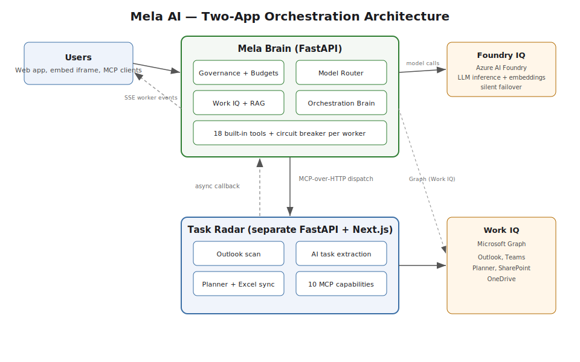

# Mela AI

Mela AI is the control plane that makes enterprise AI deployable at scale. It governs what AI costs, it grounds answers in organizational knowledge, and it runs a background agent that recovers work people committed to but never tracked.

## The problem

Organizations deploy AI across hundreds of users with no visibility into spend. Nobody can say who is consuming what, which models answer which requests, or whether an expensive model is doing work a cheap model could do. Token usage is invisible until the invoice arrives. Budgets drift, finance pushes back, and the rollout stalls.

The default settings make this worse. A request that a free model could answer often goes to the most expensive model in the catalog. There is no per-user limit, no automatic downgrade as someone nears their budget, and no single screen where an administrator can see consumption across teams. The cost of one careless prompt and one careful prompt looks identical until month-end.

Work has a second, quieter failure. Every day people commit to tasks inside Outlook threads and Teams messages. Those commitments are real, but they never become tracked tasks. They sit in a mailbox, get buried under newer mail, and drop. The work was discussed. It was agreed. It was never done.

## What Mela AI is

Mela AI is a multi-tenant enterprise AI platform where administrators govern consumption through per-user token limits and live model pricing, employees reach organizational knowledge through a Work mode that activates Microsoft 365 connectors under per-tenant access control, and a separate background agent called Task Radar monitors the communication layer for work that was committed but never tracked, then turns it into Microsoft Planner tasks.

## Three layers

**Governed consumption.** Every user has a daily token limit, defaulting to 100,000 tokens and 500,000 for administrators, enforced before each request. Live per-model pricing is read from the `model_quota_policies` table and shown to users, ranging from Gemini 2.0 Flash at 0.0000 USD per 1K tokens on the free tier and Grok-3-mini at 0.0003, up to Claude Opus 4.6 at 0.0150. As a user nears the cap, the router downgrades automatically: at 70 percent of budget it caps requests at GPT-4.1, and at 90 percent it forces GPT-4o-mini. Administrators control which models each tenant can access and watch monthly cost roll up per tenant and per model.

**Work IQ.** Personal mode answers from the model alone. Work mode activates the Microsoft 365 connectors, so the agent can read Outlook, search SharePoint and OneDrive, check the calendar, and create Planner tasks through the Microsoft Graph API. Enterprise tools are blocked in Personal mode by an explicit deny list in the tool executor, so personal sessions cannot touch corporate data. Tenant isolation is enforced at Azure AI Search and again in post-processing, and agent memory stores personal and workspace documents for retrieval. This is the Work IQ layer.

**Background task intelligence.** Task Radar runs as a separate agent in its own process. It scans Outlook through the Microsoft Graph API, runs each message through a noise filter and a deduplication stage, then extracts action items with GPT-5.2 and returns structured tasks with a confidence score. Mela Brain queries Task Radar over MCP-over-HTTP and receives results through an asynchronous callback to its ingestion API, so a long scan never blocks the chat. The user watches the dispatch run in real time in the worker event bar above the chat input. Teams channel scanning is built behind a flag and ships off by default.

## Microsoft IQ integration

| IQ surface | What it does | Where it lives |
|---|---|---|
| **Foundry IQ** | All LLM inference and text embeddings run through Azure AI Foundry. The named Foundry deployments are Kimi-K2.5, Mistral-Large-3, gpt-5.2-chat, gpt-4.1, grok-3-mini, Llama-4-Maverick, and the text-embedding-3-large embedding model. The model router serves these with silent cross-provider failover: when a provider errors before producing any content, the router switches to the next provider and the user still gets an answer. | Config keys `AI_FOUNDRY_ENDPOINT`, `AI_FOUNDRY_API_KEY`, `AI_FOUNDRY_API_VERSION`, and the `DEPLOYMENT_*` deployment names in `backend/app/core/config.py`. Router in `backend/app/services/model_router.py`. |
| **Work IQ** | Task Radar reads from Outlook and Teams as Work IQ sources. Mela Brain writes back to Work IQ outputs: it creates and updates Microsoft Planner tasks, creates Teams online meetings, sends mail, and books calendar events through Graph. It also sends operational alerts to Teams through an incoming webhook. The admin panel is the governance surface for this layer. | Graph capabilities in `backend/app/services/graph_service.py`. Admin panels in `frontend/src/components/admin/`. |

## Architecture



Mela runs as two independent applications. Mela Brain is the FastAPI platform that serves chat, governance, Work IQ, and the orchestration brain. Task Radar is a separate FastAPI and Next.js application that scans mail and creates tasks. The two communicate only through MCP-over-HTTP, and Task Radar never imports Mela code, so if Mela goes down Task Radar keeps running and if Task Radar goes down Mela degrades to its built-in tools.

Reliability is built into the dispatch path. Each worker sits behind a per-worker circuit breaker that trips to open after repeated failures and fails fast instead of hanging the request. Asynchronous results return through a callback to the ingestion API rather than a held connection, the chat streams to the browser over Server-Sent Events with a 30-second heartbeat to survive the Azure App Service timeout, and when a worker dispatch fails the alert service generates an AI triage summary and posts it to Teams as an Adaptive Card.

## Key features

Per-user daily token limits enforced before each request, with admin and standard tiers.
Live per-model pricing shown to users and editable in the Model Governance panel.
Budget-aware model downgrade that drops to a cheaper tier as a user nears the limit.
Silent cross-provider failover across Azure OpenAI, Anthropic, and Google providers.
Personal mode and Work mode, with enterprise tools denied in Personal mode.
Work IQ connectors for Outlook, SharePoint, OneDrive, calendar, and Planner over Microsoft Graph.
Per-tenant access control on workers, enforced in the tool list and again at the router.
Task Radar background agent with 10 MCP capabilities, including asynchronous Planner follow-up creation.
Agent memory for personal and workspace documents, usable as inputs to the code interpreter.
Code interpreter that runs sandboxed Python and returns downloadable files, charts, and reports.
Audit logging on every mutating tool call, with secret redaction and bounded argument size.
Onboarding automation that sends a welcome mail, schedules orientation, and creates Planner tasks.
Embed surface that exposes Mela as a `<mela-chat>` web component and an inbound MCP server.
Eighteen built-in agent tools spanning mail, calendar, tasks, enterprise search, and code execution.

## Getting started

### Prerequisites
- Python 3.11 or newer, Node.js 18 or newer.
- Azure access for Azure AI Foundry or Azure OpenAI, Azure AI Search, an Entra app registration with Microsoft Graph permissions, and either Azure SQL or local SQLite for development.

### 1. Clone
```bash
git clone https://github.com/49ochieng/the-mela-ai.git
cd the-mela-ai
```

### 2. Backend (Mela Brain)
```bash
cd backend
python -m venv venv && source venv/bin/activate   # Windows: venv\Scripts\activate
pip install -r requirements.txt
cp .env.example .env                               # then fill in the values below
alembic upgrade head
uvicorn app.main:app --port 8000
```

### 3. Task Radar
```bash
cd task-radar/apps/api
python -m venv .venv && source .venv/bin/activate  # Windows: .venv\Scripts\activate
pip install -r requirements.txt
cp ../../.env.example .env
alembic upgrade head
uvicorn app.main:app --port 8001
```

### 4. Frontend
```bash
cd frontend
npm install
cp .env.example .env.local
npm run dev
```

### Required environment variables
- `AI_FOUNDRY_ENDPOINT`, `AI_FOUNDRY_API_KEY`, `AI_FOUNDRY_API_VERSION`: Azure AI Foundry endpoint and key for model inference and embeddings.
- `AZURE_OPENAI_ENDPOINT`, `AZURE_OPENAI_API_KEY`: Azure OpenAI backbone, used when distinct from Foundry.
- `AZURE_SEARCH_ENDPOINT`, `AZURE_SEARCH_API_KEY`: Azure AI Search for RAG and tenant-scoped knowledge.
- `AZURE_TENANT_ID`, `AZURE_CLIENT_ID`, `AZURE_CLIENT_SECRET`: Entra app for app-only Microsoft Graph calls.
- `ENTRA_AUTH_CLIENT_ID`: login app registration that backend Bearer tokens are validated against.
- `JWT_SECRET_KEY`: signing key for session tokens; set this, there is no production default.
- `DATABASE_URL`: database connection string; leave blank to fall back to local SQLite.
- `AZURE_STORAGE_CONNECTION_STRING`: blob storage for uploads and agent memory.
- `TASK_RADAR_BASE_URL`, `TASK_RADAR_MCP_API_KEY`: register Task Radar with the orchestration brain.
- `TASK_RADAR_INBOUND_API_KEY`: key Task Radar presents on ingestion callbacks; without it callbacks return 401.
- `MELA_INGESTION_BASE_URL`: public URL workers post asynchronous results back to.
- Frontend: `NEXT_PUBLIC_API_URL`, `NEXT_PUBLIC_ENTRA_AUTH_CLIENT_ID`, `NEXT_PUBLIC_AZURE_AD_TENANT_ID`, `NEXT_PUBLIC_REDIRECT_URI`, `NEXT_PUBLIC_API_SCOPE`.

The full variable set with inline notes is in `backend/.env.example`, `frontend/.env.example`, and `task-radar/.env.example`.

## Competition tracks

Mela AI competes in the Enterprise Agents and Reasoning Agents tracks of the Microsoft Agents League. Its IQ integration spans Foundry IQ for model inference and embeddings and Work IQ for Microsoft 365 sources and outputs. It is submitted for the Best use of IQ tools special category.
